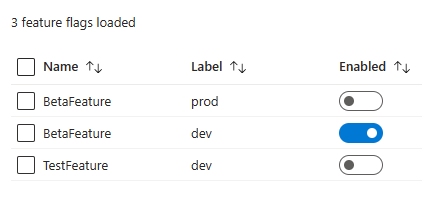

# Python Feature Flag Application with Azure App Configuration

## Overview

This Python application demonstrates the use of feature flags managed through Azure App Configuration. It provides a simple "Hello World" functionality, enhanced by the ability to toggle features and behaviors based on feature flags. This setup is ideal for differentiating behaviors in different environments like development (`dev`) and production (`prod`).

## Features

- **Feature Flag Management:** Integrates with Azure App Configuration for managing feature flags.
- **Environment-Specific Behavior:** Custom logic to determine whether the application is running in a `dev` or `prod` environment.
- **Docker Support:** Easily containerizable for consistent deployment across environments.

## Prerequisites

- Docker installed on your machine.
- An Azure account and an Azure App Configuration store set up.
- Python 3.9 or higher (for local development).

## Setup and Configuration

1. **Azure App Configuration:**
   - Set up your feature flags in the [Azure App Configuration store](https://learn.microsoft.com/en-us/azure/azure-app-configuration/manage-feature-flags).
   - Obtain the connection string from Azure App Configuration.
   - Add feature flags as appropriate, for my example I've used this setup:
     

2. **Environment File:**
   - Rename `example.env` to `.env` and fill in the variables related to your setup.

3. **Dockerfile:**
   - Use the provided `Dockerfile` for container setup.

4. **Docker Compose (Optional):**
   - Use `docker-compose.yml` to define and run the application with Docker Compose.

## Running the Application

### Using Docker

1. **Build the Docker Image:**
   - Navigate to the directory containing the Dockerfile.
   - Run `docker build -t my-python-app .` to build your Docker image.

2. **Run the Docker Container:**
   - Run `docker run -p 4000:80 -e AZURE_APP_CONFIG_CONNECTION_STRING='your_connection_string_here' -e ENVIRONMENT='prod' my-python-app`.

### Using Docker Compose

1. **Using `docker-compose.yml`:**
   - Update the environment variables in `docker-compose.yml` with your Azure App Configuration connection string and desired environment.

2. **Start the Application:**
   - Run `docker-compose up` in the directory containing `docker-compose.yml`.

## Local Development

For local development, ensure you have Python 3.9 or higher installed and run the application normally. Make sure to set the appropriate environment variables or use the `.env` file.
